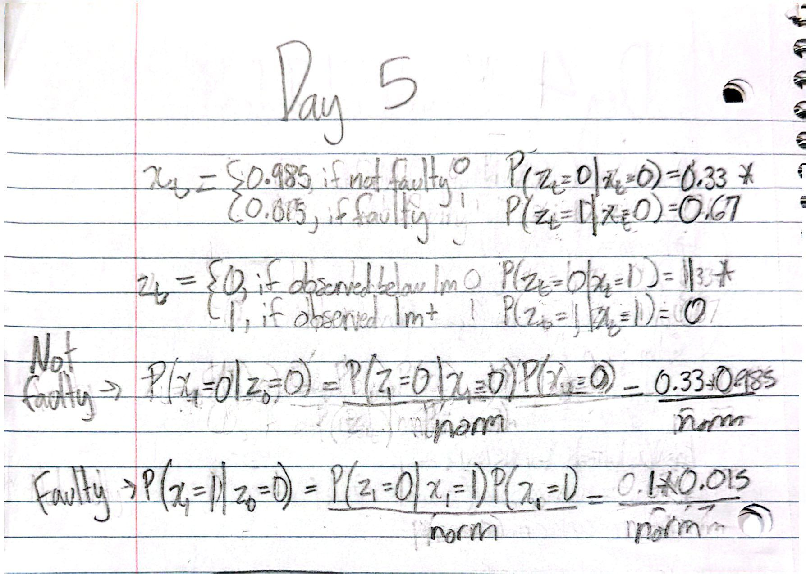

## Day 4
### Problem 1
#### Exercise 1
##### Write the form of the covariance matrix for a 3-variable system. What is the dimension of the covariance matrix?

A 3 variable matrix would be a 3x3 like this:

[Cov(X, X) Cov(X, Y) Cov(X, Z)

Cov(Y, X) Cov(Y, Y) Cov(Y, Z)

Cov(Z, X) Cov(Z, Y) Cov(Z, Z)]

#### Excercise 2
##### Compare your output with np.cov. Do you get the same answers?
Yes

#### Excercise 3
##### Read through the numpy documentation for the corrcoef function and implement your own version on the problem you just completed.
Done

### Problem 2
#### Part A
##### Using matplotlib (or plotting library of your choice), generate a few plots of the data.
Done

#### Part B
##### Compute the covariance and correlation coefficient matrices for the following
Done

#### Part C
The relational covariances capture how well multiple components are aligned with each other. Meanwhile, the mean and variance residuals capture the accuracy of the IMU compared to ground thruth and the consistancy of an individual component, respectively. Together, these portay the noise, stabilty, and relationships between components in a system.

#### Part D
It was suprising that some of the coeff and covariance variables were drastically different than the rest. The residuals change overtime which means the IMU noise changes overtime. While variance/covariance is useful for capturing some noise, it does not account for other noise like saturation error. When performing an inference update over the odometry, the IMU data becomes more trustworthy assuming the noise model is accurate. This is because the data becomes updated based on immediate info rather than the inital starting point. The axes with the lowest residuals are probably the most trustworthy.  

## Day 5
### Problem 1
#### Exercise 1
Done. Attached is the work

#### Exercise 2
##### Version 1
At k=1, the distrubution is room 1: 0, room 2: 0.5, and room 3: 0.5.

At k=2, the distrubution is room 1: 0, room 2: 0.55, and room 3: 0.45.

The further the timestep, the less even the distrubution becomes.

##### Version 2
With filtering, the robot is likely to go: {Room 1, Room 3, Room 3, Room 2, Room 3}.

With smoothing, the robot is likely to go: {Room 1, Room 3, Room 2, Room 2, Room 3}.

### Problem 2
#### Part A

#### Part B

#### Part C

#### Part D
